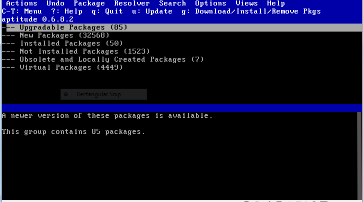
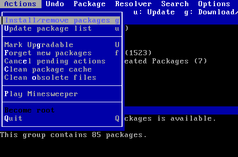
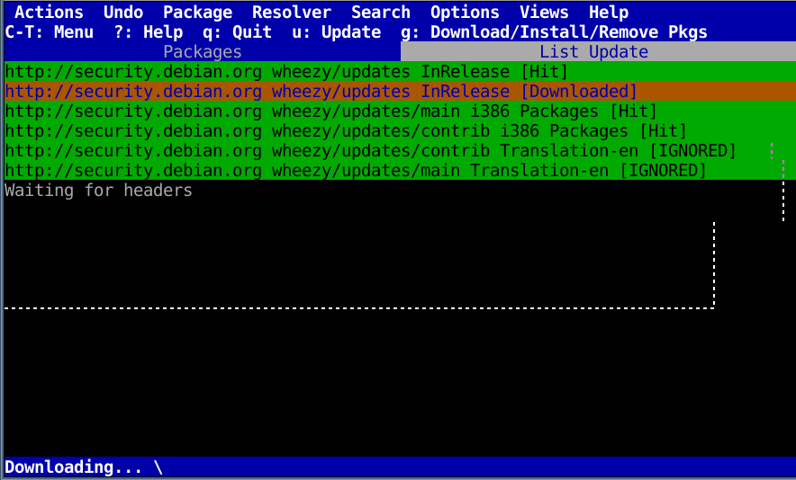
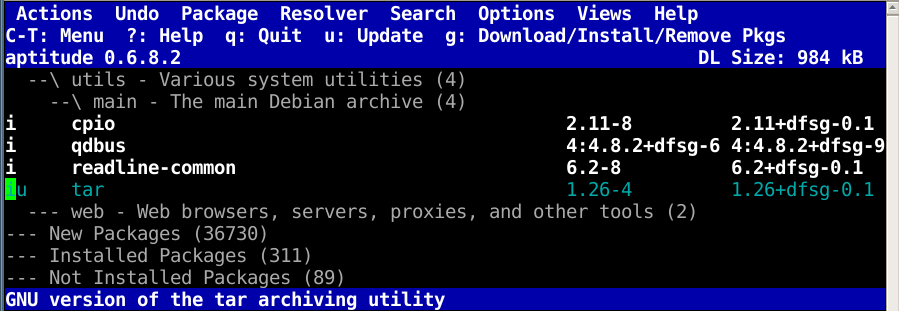
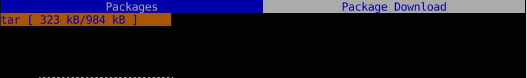

Aptitude
=======
Sekilas tentang Aptitude
------------------------

Aptitude merupakan paket manager Debian GNU/Linux yang berbasiskan text menggunakan antarmuka ``ncurses``. 
Aptitude merupakan ``front-end`` lain dari ``APT`` yang sudah begitu terkenal di Debian GNU/linux. 
``Aptitude`` bisa bekerja langsung untuk kegiatan manajemen paket di command line maupun berjalan dalam mode 
interaktif dalam antarmuka ``semigrafis`` di console. Kita dapat melihat paket-paket yang terinstall, informasi tentang paket, upgrade yang tersedia, 
memilih berbagai paket yang tersedia untuk diinstall maupun diremove.

Aptitude dalam mode interaktif
------------------------------
 
Untuk menjalankan ``aptitude`` dalam mode interaktif, jalankan perintah ini di terminal::

	debian:~# aptitude

Saat dijalankan, aptitude menampilkan datfar paket-paket yang di``sortir`` sesuai keadaannya (installed, non-installed, menampilkan grup tasks, paket virtual, dan paket yang masuk kategori ``new``).
Kategori diatur mirip stuktur ``tree`` seperti yang biasa kita lihat pada file manager/explorer, yang bisa diexpand atau diclose dengan menggunakan tombol-tombol navigasi pada keyboard komputer.

Navigasi dengan Aptitude
------------------------

Beberapa ``key``  yang umum digunakan untuk navigasi berbagai fasilitas yang ada dalam ``aptitude`` adalah:

- **Enter**	==> untuk mengeksekusi menu, ataupun kegunaan lain.

- **Tab**	==> Untuk navigasi ke berbagai pilihan.

- **[**	==> untuk meng-*expand* menu dari group yang dipilih, bisa juga menggunakan Enter.

- **]**	==> Untuk meng-*collaps* menu dari group yang aktif, bisa juga menggunakan Enter.

- **Arrow key**, ==> untuk navigasi yang diperlukan 

- **Ctrl+T**	==> Untuk membuka menu dari aptitude

.. warning:: Pada awalnya memang agak memerlukan waktu untuk memahami dalam menggunakan ``aptitude`` ini, jadi bersabarlah :)

Operasi manajemen paket dengan Aptitude
---------------------------------------

Update database APT dengan aptitude
***********************************

Gunakan tombol keyboard `u` untuk melakukan update, seperti halnya perintah ``apt-get update``.  

Hal ini juga bisa dilakukan secara langsung dengan aptitude::

	debian:~#aptitude update

Menginstall paket dengan aptitude
*********************************

Setelah melakukan update, dan akan melakukan installasi paket yang diinginkan, langkahnya adalah sebagai berikut ::

1. Mark (beri tanda) pada paket yang akan diinstall, dengan menggunakan tombol ``+``
Misal, kita mau menginstall paket ``tar``, arahkan kursor pada paket ``tar`` dan kemudian tekan ``+``, seperti terlihat pada gambar berikut:

2. Lakukan eksekusi perintah untuk menginstall dengan menggunakan tombol ``g``

3. Enter untuk menjalankan proses selanjutnya, dan tunggu sampai proses selesai
